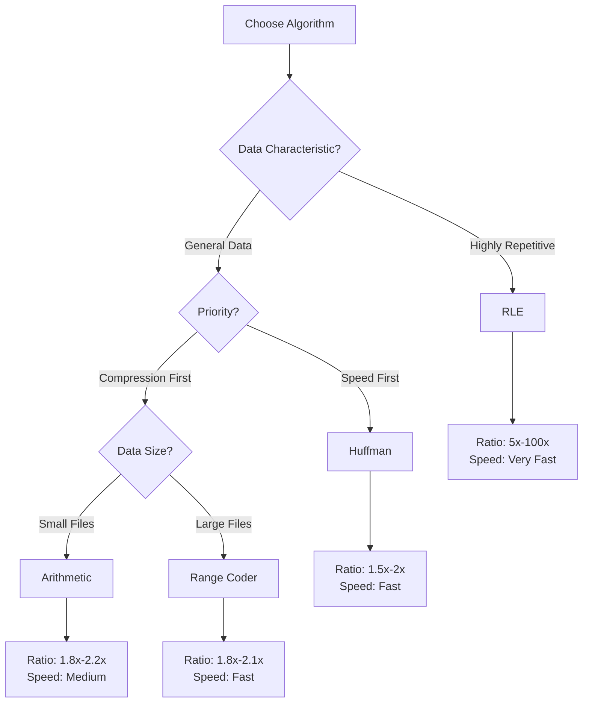

# Algorithm Academy

Welcome to the CompressKit Algorithm Academy. Here you will gain deep understanding of the principles, implementation details, and performance characteristics of four classic lossless compression algorithms.

## Academy Goals

- **Theoretical Depth**: Understand the mathematical foundations and information theory principles
- **Implementation Insights**: Master key design decisions for cross-language binary compatibility
- **Performance Wisdom**: Learn to choose optimal algorithms based on data characteristics
- **Engineering Practice**: Production-grade design from state machines to error handling

## Four Algorithms Overview

  

    
🌳 Huffman Coding

    

      Frequency-based optimal prefix codes, greedy strategy builds minimum-weight path length tree.
    

    

      <a href="./huffman" class="feature-tag">Learn More</a>
      H ≤ L < H+1
    

  

  

    
🧮 Arithmetic Coding

    

      Encodes the entire message as a single number in [0,1) interval, approaching entropy limit.
    

    

      <a href="../algorithms/arithmetic" class="feature-tag">Learn More</a>
      L ≈ H + ε
    

  

  

    
🎯 Range Coding

    

      Integer-based arithmetic coding variant, avoiding floating-point precision issues.
    

    

      <a href="../algorithms/range" class="feature-tag">Learn More</a>
      Byte-level I/O
    

  

  

    
📏 Run-Length Encoding

    

      The simplest compression method, extremely efficient for consecutive repeated data.
    

    

      <a href="../algorithms/rle" class="feature-tag">Learn More</a>
      O(n) Time
    

  

## Learning Path

### Beginner: Understanding Basics

1. [Huffman Coding](/en/algorithms/huffman) - From greedy algorithm to optimal prefix codes
2. [Run-Length Encoding](/en/algorithms/rle) - Simplest but practical compression method

### Intermediate: Mastering Principles

3. [Arithmetic Coding](/en/algorithms/arithmetic) - Interval partitioning and precision handling
4. [Range Coding](/en/algorithms/range) - Engineering wisdom of integer implementation

### Advanced: System Design

5. [Streaming API](/en/api/streaming) - Core of the streaming architecture
6. [Cross-Language Testing](/en/testing/cross-language) - Binary compatibility verification
7. [Architecture Design](/en/architecture/) - System architecture overview

## Algorithm Selection Decision Tree

## Core Concepts

### Entropy and Compression Limit

Information entropy $H$ defines the theoretical lower bound for lossless compression:

$$
H = -\sum_{i=1}^{n} p_i \log_2 p_i
$$

Where $p_i$ is the probability of symbol $i$ appearing. **No lossless compression algorithm can compress data to less than its entropy value**.

### Compression Efficiency Comparison

| Algorithm | Avg. Code Length L | Theoretical Guarantee | Time Complexity |
|-----------|-------------------|----------------------|-----------------|
| Huffman | H ≤ L < H+1 | Optimal prefix code | O(n log σ) |
| Arithmetic | L ≈ H + ε | Approach entropy limit | O(n) |
| Range | L ≈ H + ε | Integer approximation | O(n) |
| RLE | Highly variable | No guarantee | O(n) |

σ = alphabet size (256), H = entropy, ε = very small error term

## Next Steps

Choose an algorithm to start learning in depth, or check the [Quick Start Guide](/en/guide/getting-started).
