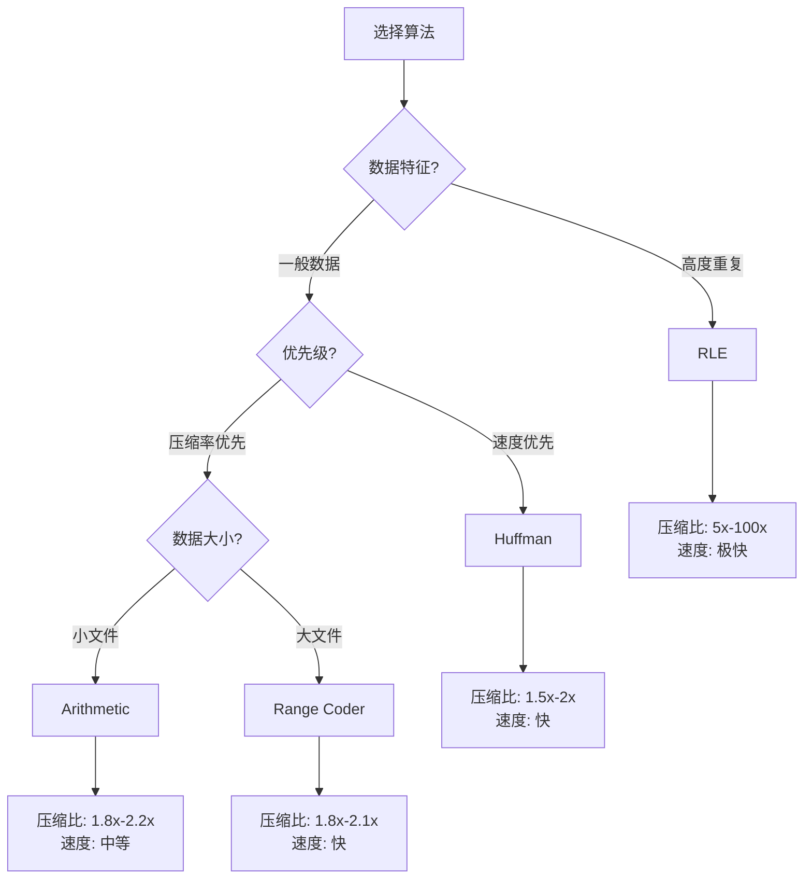

# 算法学院

欢迎来到 CompressKit 算法学院。在这里，你将深入理解四种经典无损压缩算法的原理、实现细节和性能特征。

## 学院目标

- **理论深度**：理解每种算法的数学基础和信息论原理
- **实现洞察**：掌握跨语言二进制兼容的关键设计决策
- **性能智慧**：学会根据数据特征选择最优算法
- **工程实践**：从状态机到错误处理的生产级设计

## 四大算法概览

  

    
🌳 霍夫曼编码

    

      基于频率的最优前缀码，贪心策略构建最小带权路径长度树。
    

    

      <a href="./huffman" class="feature-tag">深入学习</a>
      H ≤ L < H+1
    

  

  

    
🧮 算术编码

    

      将整个消息编码为 [0,1) 区间内的单个数值，逼近熵极限。
    

    

      <a href="../algorithms/arithmetic" class="feature-tag">深入学习</a>
      L ≈ H + ε
    

  

  

    
🎯 区间编码

    

      基于整数区间的算术编码变体，避免浮点精度问题。
    

    

      <a href="../algorithms/range" class="feature-tag">深入学习</a>
      字节级 I/O
    

  

  

    
📏 行程编码

    

      最简单的压缩方法，对连续重复数据极其高效。
    

    

      <a href="../algorithms/rle" class="feature-tag">深入学习</a>
      O(n) 时间
    

  

## 学习路径

### 初级：理解基础

1. [霍夫曼编码](/zh/algorithms/huffman) - 从贪心算法到最优前缀码
2. [行程编码](/zh/algorithms/rle) - 最简单但实用的压缩方法

### 中级：掌握原理

3. [算术编码](/zh/algorithms/arithmetic) - 区间划分与精度处理
4. [区间编码](/zh/algorithms/range) - 整数实现的工程智慧

### 高级：系统设计

5. [状态机设计](/zh/academy/state-machine) - 5 状态有限状态机
6. [跨语言测试](/zh/testing/cross-language) - 二进制兼容性验证
7. [系统架构](/zh/architecture/) - 系统架构总览

## 算法选择决策树

## 核心概念

### 熵与压缩极限

信息熵 $H$ 定义了无损压缩的理论下限：

$$
H = -\sum_{i=1}^{n} p_i \log_2 p_i
$$

其中 $p_i$ 是符号 $i$ 的出现概率。**没有任何无损压缩算法能将数据压缩到小于其熵值的程度**。

### 压缩效率对比

| 算法 | 平均码长 L | 理论保证 | 时间复杂度 |
|------|-----------|----------|-----------|
| Huffman | H ≤ L < H+1 | 最优前缀码 | O(n log σ) |
| Arithmetic | L ≈ H + ε | 逼近熵极限 | O(n) |
| Range | L ≈ H + ε | 整数逼近 | O(n) |
| RLE | 变化极大 | 无保证 | O(n) |

σ = 字母表大小（256），H = 熵，ε = 很小的误差项

## 下一步

选择一个算法开始深入学习，或者直接查看 [快速开始指南](/zh/guide/getting-started)。
